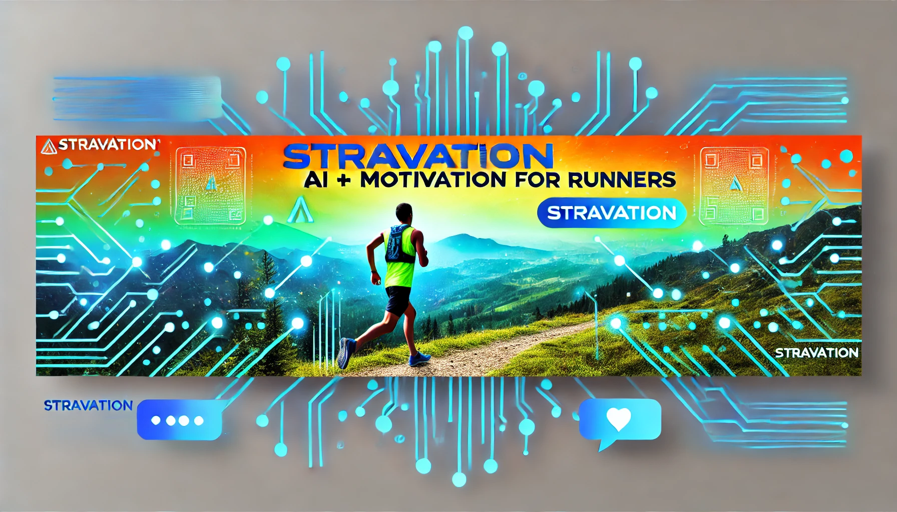

# ✨ Stravation ✨

**_A play on words between Strava and Motivation_**



Welcome to **Stravation**, the ultimate app that combines the power of **AI**, **Supabase Realtime**, and **BLE fitness wearables** to keep you motivated during your runs! 🏃‍♂️💨 Whether you're tackling an endurance event or just enjoying a morning jog, Stravation ensures you stay encouraged every step of the way. 🎉

## 🚀 Features

- **Real-time Route Tracking** 📍
  - Keep friends and family updated on your running route as you move.
- **Live Motivational Messages** 💬
  - Receive messages of positivity from your loved ones to boost your morale.
- **AI-Generated Motivations** 🤖
  - Our AI combines incoming messages and live heart rate data to create hilarious and harsh motivational scripts to keep you pushing forward.
- **BLE Heart Rate Tracking** ❤️
  - Integrates with fitness wearables to retrieve live heart rate data for personalized AI motivation.
- **Social Connectivity** 👥
  - Let your support network tune into your runs and send timely encouragement.
- **User-Friendly Interface** 🎨
  - Beautiful and intuitive design to make your running experience seamless.

## 🛠️ Setup & Installation

### 🔧 Prerequisites

Before you begin, ensure you have met the following requirements:

- **Xcode**: Latest version installed on your Mac.
- **SwiftUI**: Familiarity with SwiftUI for any development tweaks.
- **API Keys**: You need your own API keys for [OpenAI](https://openai.com/) and [Eleven Labs](https://elevenlabs.io/) due to the pricing of these services.

### 📅 Installation Steps

1. **Clone the Repository**

   ```bash
   git clone https://github.com/aaronByrne1/Stravation.git
   cd stravation
   ```

2. **Install Dependencies**

   Ensure you have [CocoaPods](https://cocoapods.org/) installed. Then, install the necessary pods:

   ```bash
   pod install
   ```

3. **Configure API Keys**

   Update your API keys directly in the corresponding files in the `Services` folder, such as `ElevenLabsService` and `OpenAIService`. For example:

   ```swift
   private let apiKey = "your_api_key_here" // Replace with your actual API key
   ```

   > **ℹ️ Note:** Never commit your API keys to version control to keep them secure! I have commited my Supabase to let anyone easily use the app. Proabaly not smart.

4. **Open the Project**

   Open the `.xcworkspace` file in Xcode:

   ```bash
   open Stravation.xcworkspace
   ```

5. **Build and Run**

   Select your target device or simulator in Xcode and hit **Run**! 🚀

## 🖋️ Usage

1.  **Launch the App** 📱

    Open Stravation on your device.

2.  **Authenticate** 🔐

    Sign in with aaronbyrne056@gmail.com or aabyrne@tcd.ie.
    Password is 'Password'

3.  **Pair Your Wearable** ❤️

    Connect your BLE-enabled fitness wearable to track your heart rate in real time.

4.  **Start a Run** 🏁

    Enter your desired distance and pace, then begin your run.

5.  **Receive Motivations** 🎤

    As you run, receive real-time updates and AI-generated motivational scripts tailored to your heart rate and pace.

6.  **Connect with Friends** 🤝

    Let your friends and family tune into your run and send you messages of encouragement.

## 🔧 Known Issues

- **Route Updates Delay** ⏳

  - Sometimes, route updates may lag slightly due to network connectivity.

- **AI Script Glitches** 🤖💬

  - Occasionally, the AI-generated scripts might repeat messages or behave unexpectedly.

_We’re actively working on these bugs! Any contributions are welcome._ 🛠️✨

## 🤝 Contributing

We love contributions from the community! Here's how you can help:

1.  **Fork the Repository** 🍄
2.  **Create a New Branch**

    ```bash
    git checkout -b feature/YourFeature
    ```

3.  **Make Your Changes** ✨
4.  **Commit Your Changes**

    ```bash
    git commit -m "Add some feature"
    ```

5.  **Push to the Branch**

    ```bash
    git push origin feature/YourFeature
    ```

6.  **Open a Pull Request** 🔀

_Please ensure your code follows our coding standards and passes all tests before submitting a pull request._

## 🙏 Acknowledgements

- [Supabase](https://supabase.com/) for providing the real-time backend services.
- [OpenAI](https://openai.com/) for powering our AI motivations.
- [Eleven Labs](https://elevenlabs.io/) for their cutting-edge text-to-speech solutions.

---

✨ **Work is still in progress, and we're ironing out some bugs, but we're excited to share Stravation as our entry for the hackathon. Thank you for checking out our project!** ✨


